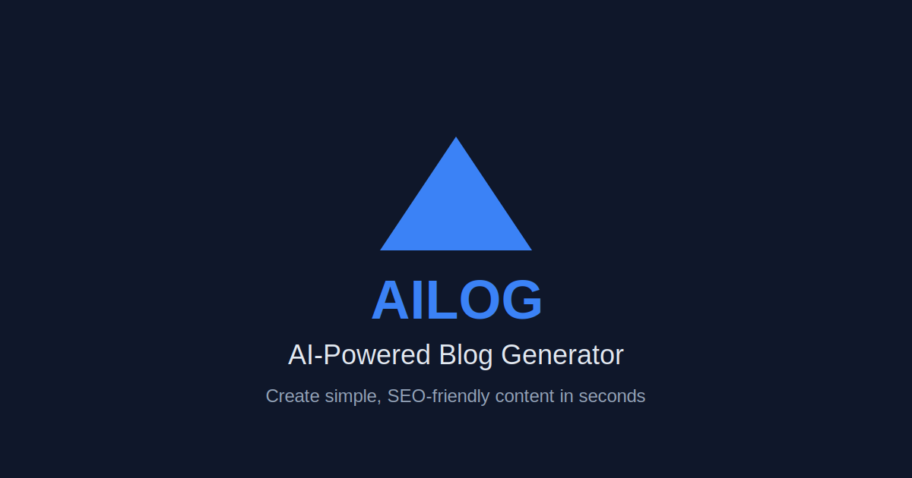

# AILOG - AI-Powered Blog Generator

AILOG is a modern, minimalist web application that uses Google's Gemini 2.0 Flash AI model to generate well-structured, SEO-friendly blog posts in simple, easy-to-understand English.



## Features

- **Simple English Focus**: All content is written in clear, easy-to-understand language without complex vocabulary
- **SEO-Friendly Structure**: AI generates well-structured content that search engines love
- **Futuristic UI**: Beautiful, responsive design with animations and gradient effects
- **One-Click Copy**: Easily copy generated content with a single click
- **Mobile Optimized**: Fully responsive design with mobile-specific features

## Tech Stack

- **Frontend**: Next.js 15, React 19, TypeScript
- **Styling**: Tailwind CSS 4 with custom animations
- **AI Integration**: Google Generative AI (Gemini 2.0 Flash)
- **Deployment**: Vercel

## Getting Started

### Prerequisites

- Node.js 18.17.0 or later
- npm or yarn

### Installation

1. Clone the repository:
   ```bash
   git clone https://github.com/SolsticeCartel/ailog.git
   cd ailog
   ```

2. Install dependencies:
   ```bash
   npm install
   # or
   yarn install
   ```

3. Create a `.env.local` file in the root directory with your Gemini API key:
   ```
   NEXT_PUBLIC_GEMINI_API_KEY=your_api_key_here
   ```

4. Run the development server:
   ```bash
   npm run dev
   # or
   yarn dev
   ```

5. Open [http://localhost:3000](http://localhost:3000) in your browser to see the application.

### Building for Production

```bash
npm run build
# or
yarn build
```

## Usage

1. Enter a topic or prompt in the text area
2. Click "Generate Blog" and wait a few seconds
3. Review your professionally written blog post
4. Use the copy buttons to copy the title or content
5. Paste the content wherever you need it

## License

This project is licensed under the MIT License - see the [LICENSE](LICENSE) file for details.

## Acknowledgements

- [Google Generative AI](https://ai.google.dev/) for providing the Gemini API
- [Next.js](https://nextjs.org/) for the React framework
- [Tailwind CSS](https://tailwindcss.com/) for styling
- [Vercel](https://vercel.com/) for hosting 